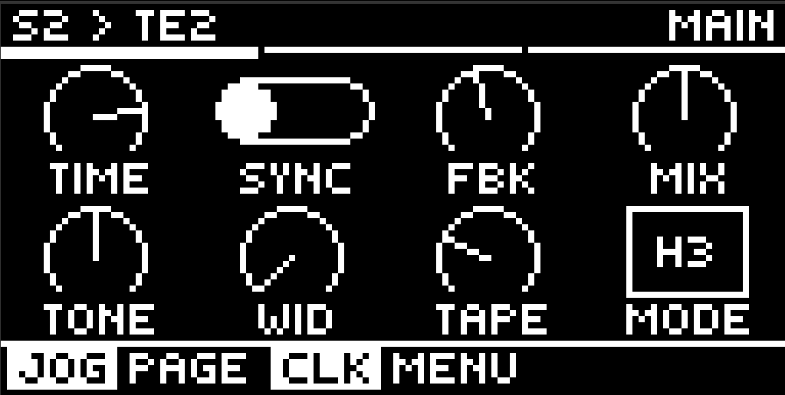
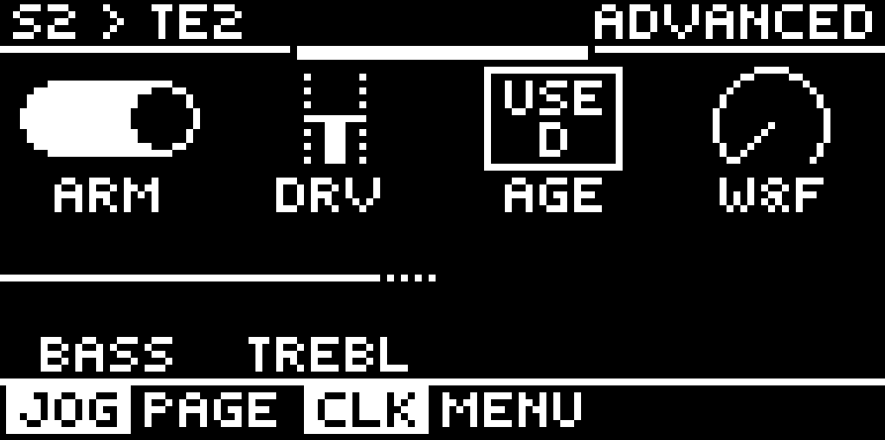
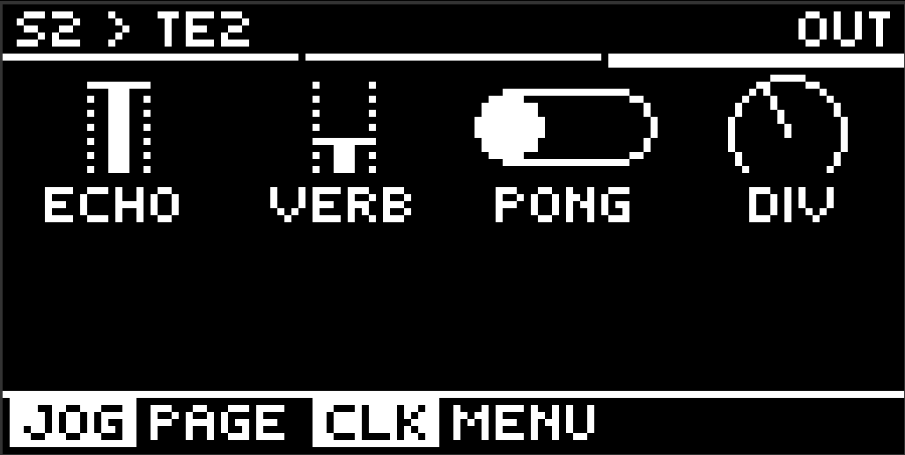
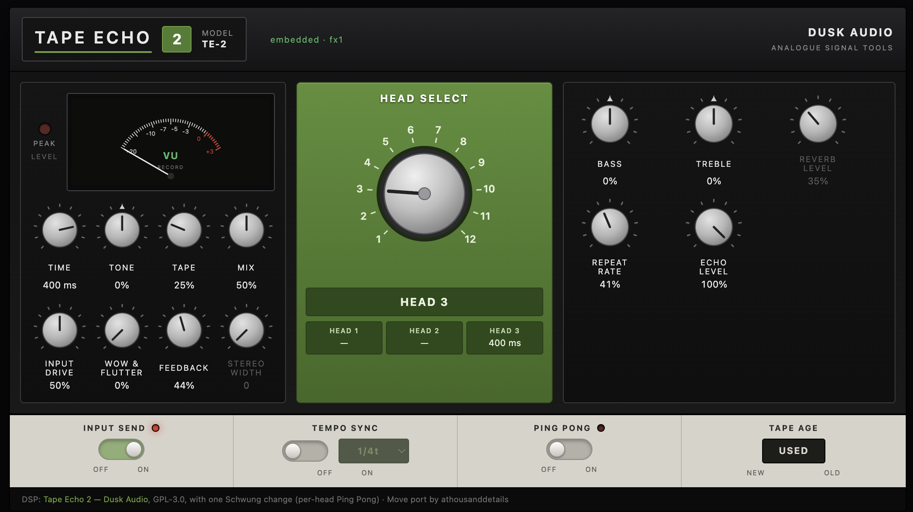

# Tape Echo 2 — Tape Echo and Spring Reverb for Ableton Move

A component-modelled vintage three-head tape echo with spring reverb for
[Schwung](https://github.com/charlesvestal/schwung) on Ableton Move. Twelve
head and reverb combinations, record EQ and tape saturation inside the
feedback loop so every repeat darkens and compresses, wow and flutter, tape
age, and tempo sync with the reference machine's leading-head note tables.





## Controls

| Page | 1 | 2 | 3 | 4 | 5 | 6 | 7 | 8 |
|---|---|---|---|---|---|---|---|---|
| **Main** | Time | Sync | Fbk | Mix | Tone | Width | Tape | Mode |
| **Advanced** | Arm | Drive | Age | W&F | Bass | Treble | Rate | — |
| **Out** | Echo | Verb | Pong | Div | — | — | — | — |

Main is the front page. **Time** is in milliseconds and stays within the
current head, so it never fights Mode. **Tone**, **Tape** and **Width** are
macros over real parameters — Tone tilts Bass against Treble, Tape moves Wow &
Flutter with Tape Age (age multiplies flutter, so they belong together), and
Width arms Ping Pong on a rising edge, which keeps `Pong Off / Width 100`
reachable. Everything a macro touches is still on Advanced or Out and moves
there too.

Modes are `H1 H2 H3 H2+3 H1+R H2+R H3+R H12+R H23+R H13+R H123R Rev` — digits
are the live playback heads, `R` is the spring tank.

Fbk above ~75% self-oscillates. Arm is the dub switch: off stops feeding the
tape while existing repeats wash out — the spring still hears you, so a `+R`
mode keeps reverberating. Bass and Treble are on the echo path only.

Pong alternates successive repeats left and right, Width sets how far it
swings. Each head alternates on its own delay, so the multi-head modes separate
too. With it off the echo bus is mono and the output is bit-identical to Dusk
Audio's original — the build checks that against a fresh copy of upstream on
every run.

Tape Echo 2 reads the older [TapeDelay](https://github.com/charlesvestal/schwung-space-delay)
module's settings: the stored delay time picks the playback head that can reach
it, and feedback, mix, tone, note division and stereo width carry across,
calibrated per head against measured decay rather than a flat scale. A patch
names the module it wants, though, so point it at this one first:

```bash
python3 tools/convert_tapedelay_patch.py MyPatch.json
```

Works with [Movy](https://github.com/DimaDake/schwung-movy) — a
`movy_config.json` ships with the module.

## Remote panel

A tape-deck style editor in the browser: draggable knobs, mode and rate-note
selectors, tempo sync and input send switches, and a record meter. Open it
while the module is loaded in an FX slot:

```
move.local:7700/api/remote-ui/module-assets/tape-echo2/web_ui.html
```

On a Schwung that offers custom UIs to FX slots
([#253](https://github.com/charlesvestal/schwung/pull/253)) the same panel
appears inside the module's section on `move.local:7700/remote-ui`. It reads
the component it is driving from the host, so it addresses the right FX slot
either way.



## Install

Via the Schwung Module Store, or manually: copy `dist/tape-echo2/` to
`/data/UserData/schwung/modules/audio_fx/tape-echo2/` on the device.

## Building

Requires Docker (cross-compiles for the Move's ARM64, pinned to glibc 2.35):

```bash
./scripts/build.sh               # builds build/tape-echo2.so + dist/tape-echo2-module.tar.gz
./scripts/deploy.sh <host>       # safe deploy (atomic rename, never over a live .so)
```

## Credits

- **[Tape Echo 2](https://github.com/dusk-audio/dusk-audio-plugins/tree/main/plugins/tape-echo)**
  by **Dusk Audio** (GPL-3.0) — the DSP, and all of the modelling credit.
  The core in `src/ported/` carries one Schwung-specific change, marked in the
  files: a per-head ping-pong stage on the echo output tap. Switch Ping Pong
  off and it is upstream sample for sample, which the build verifies against a
  fresh checkout of the original.
- **[@charlesvestal](https://github.com/charlesvestal)** — Schwung itself, and
  a substantial contribution back to this module: the macro front page, a
  per-head calibration of the TapeDelay import, and repairs to the
  core-equivalence gate ([#1](https://github.com/athousanddetails/schwung-tape-echo2/pull/1)).
- Move port by athousanddetails.

GPL-3.0, inherited from upstream.
